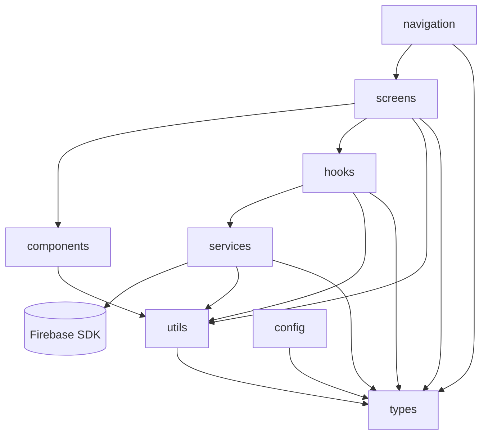

# Architecture — Goald

> DORA 2025 (ARCH-01): "Teams working in loosely coupled architectures with fast
> feedback loops see AI gains. Those in tightly coupled systems see little or no benefit."
> ESLint enforces these boundaries. CI fails on violations.

---

## Layer Definitions

```
screens/     → Navigation targets. UI composition only.
               MAY import: components/, hooks/, types/, config/
               MUST NOT: call Firebase SDK, contain business logic

components/  → Reusable UI primitives (AppButton, GoalCard, EmptyState).
               MAY import: types/, utils/ (display formatting only)
               MUST NOT: import from services/, hooks/, screens/

hooks/       → React state management and data subscriptions.
               MAY import: services/, types/, utils/
               MUST NOT: call Firebase SDK directly

services/    → All Firestore reads/writes. All Firebase Auth calls.
               MAY import: types/, utils/
               MUST NOT: import from screens/, components/, hooks/

utils/       → Pure functions. Stateless business logic.
               (compoundInterest, streakCalculator, badgeRules, validators)
               MAY import: types/ only
               MUST NOT: import from any other layer. No React. No Firebase.

types/       → Shared TypeScript types. (src/types/index.ts)
               MUST NOT: import from anywhere.

config/      → Feature flags, environment config, runtime constants.
               MAY import: types/
               MUST NOT: contain business logic.

navigation/  → React Navigation stack definitions.
               MAY import: screens/, types/
               MUST NOT: contain data calls.
```

## Dependency Diagram



## One File Per Layer (Concrete Examples)

| Layer | Example File | What It Does |
|---|---|---|
| screens | `src/screens/GoalDetailScreen.tsx` | Renders goal UI, calls `useGoal` hook |
| components | `src/components/GoalCard.tsx` | Reusable card UI, no data fetching |
| hooks | `src/hooks/useGoal.ts` | Subscribes to Firestore via goalService |
| services | `src/services/goalService.ts` | All Firestore goal reads/writes |
| utils | `src/utils/compoundInterest.ts` | Pure growth projection functions |
| types | `src/types/index.ts` | Goal, Deposit, UserStats interfaces |
| config | `src/config/featureFlags.ts` | Runtime feature flags with remote override |

## ESLint Configuration

Layer boundaries are enforced via `eslint-plugin-import` with `no-restricted-imports` rules.
See `.eslintrc.js` for the rule configuration.

**Key rules:**
- `utils/**` may not import from `services/**`, `hooks/**`, or `screens/**`
- `components/**` may not import from `services/**` or `screens/**`
- `services/**` may not import from `screens/**` or `components/**`
- `screens/**` may not import directly from other screens (no cross-screen imports)

## Known Violation History

When a violation is fixed, record it here so we know the codebase was cleaned up:

| Date | File | Violation | Fixed In |
|---|---|---|---|
| [placeholder] | | | |
